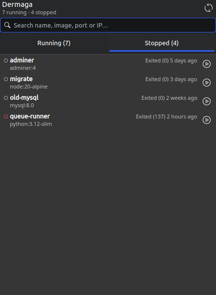
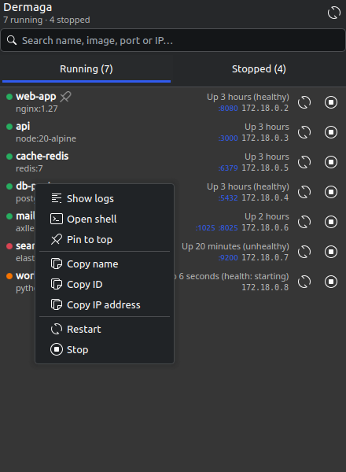
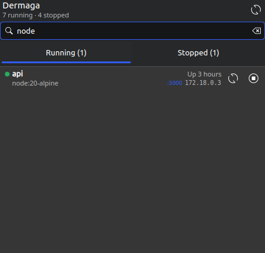
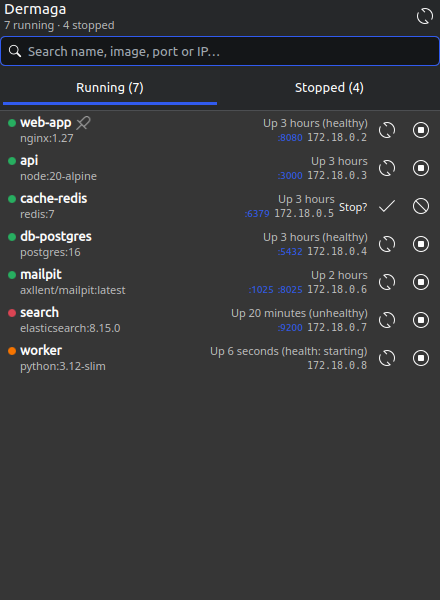
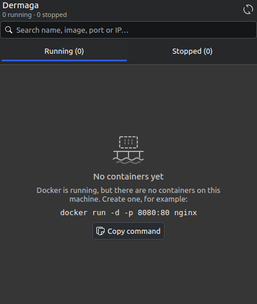
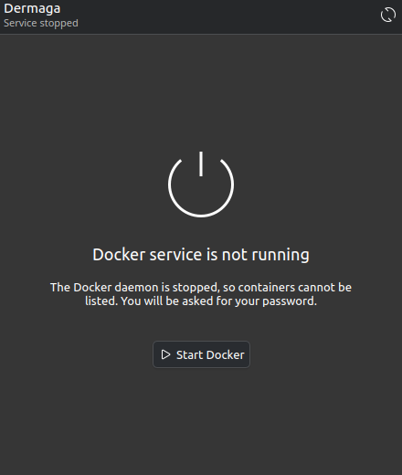
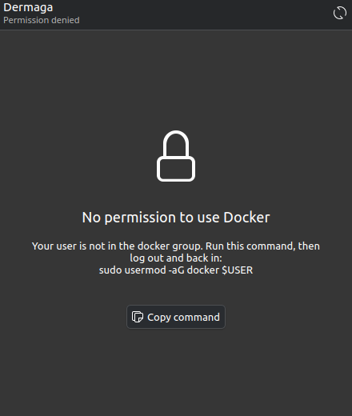
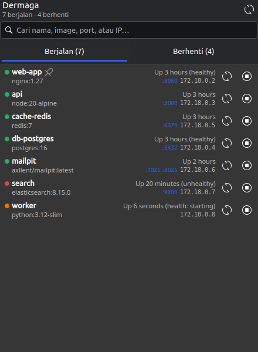
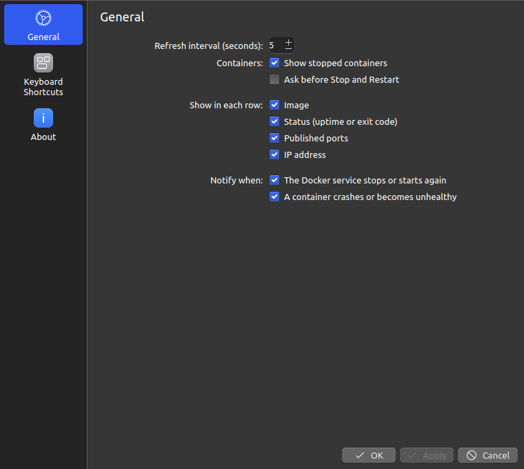

# Dermaga – Docker Containers

A KDE Plasma 6 widget that shows your Docker containers in the panel. Start, stop,
restart, read logs or open a shell without going to the terminal first.

*Dermaga* is Indonesian for "pier", where containers dock.

- Pure QML + JavaScript, nothing to compile
- Follows your Plasma theme (light and dark, Wayland and X11)
- English and Indonesian
- Talks to the `docker` CLI only; no extra services, no root (except to start the Docker service, via `pkexec`)

## Features

- **Panel icon with a badge** showing how many containers are running, or `!` when Docker cannot be used.
- **Running and Stopped tabs**, each with its count.
- **Compact rows** (one or two lines) with name, status, image, published ports and IP.
- **Click to act**: a port opens `http://localhost:<port>` in your browser; the name or the IP copies to the clipboard.
- **Start, stop and restart** buttons on every row.
- **Right-click menu**: show logs, open a shell, copy name / ID / IP, start / stop / restart.
- **Health at a glance**: the status dot shows healthy, starting, unhealthy or failed containers.
- **Search** across name, image, port and IP, in both tabs.
- **Desktop notifications** when the Docker service stops or a container crashes or turns unhealthy.
- **Pin** the containers you use most to the top of their tab.
- **CPU and memory** of a running container when you rest the pointer on it.
- **Confirmation** before Stop and Restart (can be turned off).
- **Keyboard friendly**: type to search, arrows to move, Enter for the menu.

## Screenshots

| | | |
| --- | --- | --- |
|  |  |  |
| Running tab: health dots, ports, IPs, a pinned container | Stopped tab: the red ring marks an error exit | Right-click menu |
|  |  |  |
| Search across both tabs | Asking before Stop | No containers yet |
|  |  |  |
| Docker service stopped | No permission to use Docker | In Indonesian |

Screenshots use demo data; see *Development* to regenerate them.
- **Helpful empty and error screens** that explain what is wrong and offer the fix.
- **Settings** for the refresh interval and which details each row shows.

## Requirements

- KDE Plasma 6.0 or newer
- Docker Engine with the `docker` CLI, managed by systemd
- Your user in the `docker` group (the widget tells you how if not)
- Optional: Konsole or another terminal for logs and shell

Docker Desktop, rootless Docker and Podman are not tested yet.

## Install

**From the KDE Store**: right-click the panel, choose *Add Widgets…*, then
*Get New Widgets…* → *Download New Plasma Widgets*, and search for "Dermaga".

**From a release file**: download `dermaga-<version>.plasmoid`, then

    kpackagetool6 -t Plasma/Applet -i dermaga-<version>.plasmoid

**From source**:

    git clone https://github.com/adweb-id/plasma-dermaga.git
    cd plasma-dermaga
    kpackagetool6 -t Plasma/Applet -i .

Installing only makes the widget available. To show it, right-click the panel,
choose *Add Widgets…* and drag **Dermaga** onto the panel.

Update or remove:

    kpackagetool6 -t Plasma/Applet -u .
    kpackagetool6 -t Plasma/Applet -r com.adweb.dermaga

After an update, restart Plasma to load the new code:

    kquitapp6 plasmashell && kstart plasmashell

## Using the widget

### Panel icon

| Badge | Meaning |
| --- | --- |
| Number | Running containers. Hidden when none are running. |
| `!` | Docker cannot be used: not installed, no permission, or the service is stopped. Hover for the reason, click for the fix. |

Hover the icon for a summary such as "6 running · 35 stopped".
Right-click the icon for **Show stopped containers**, a check box that turns the
Stopped tab on or off without opening the settings.

### The container row

With all details turned on, each container takes two lines:

    ● rw_db                          Up 28 hours    ⟳  ■
      mariadb:10.4.13       :32002   172.23.0.3

When the image is hidden in the settings, ports and IP move up and the row
becomes a single line:

    ● rw_db         :32002  172.23.0.3   Up 28 hours    ⟳  ■

Untagged images (`sha256:…`) are shortened to the 12-character ID, as `docker ps` does.
Long names are cut with "…" only when the row is too narrow; there is no fixed limit.

Pinned containers show a pin after the name and stay at the top of their tab.
While the pointer rests on a running container, the status text changes to its
CPU and memory use, e.g. "CPU 0.35% · RAM 42.1MiB" (sampled with `docker stats`
at most every 10 seconds, only for the row under the pointer).

| Click on | Does |
| --- | --- |
| Name | Copies the container name. It turns green briefly to confirm. |
| `:port` | Opens `http://localhost:<port>` in your default browser. |
| IP | Copies the IP address. It turns green briefly to confirm. |
| ⟳ / ■ / ▶ | Restart, stop or start. A spinner shows while Docker works; errors appear under the row. Unless *Ask before Stop and Restart* is turned off, the row first asks "Stop?" with ✓ and ✗ (it gives up after 6 seconds). |
| Anywhere, right button | Opens the menu below. |

Port ranges such as `80-81->80-81/tcp` are shown as separate ports (up to 10 per range).

### Status dot

Hover the dot to see what it means.

| Dot | Meaning |
| --- | --- |
| Green, filled | Running (healthy, or no health check) |
| Orange, filled | Health check still starting, restarting, or paused |
| Red, filled | Running, but the health check fails |
| Grey ring | Stopped normally (exit code 0, or created but never started) |
| Red ring | Stopped with an error (non-zero exit code, or dead) |

### Right-click menu

| Item | What it runs |
| --- | --- |
| Show logs | Opens a terminal with `docker logs -f --tail 200 <id>` |
| Open shell | Running containers only: opens a terminal with `docker exec -it <id>`, using `bash` when available, otherwise `sh` |
| Pin to top / Unpin | Keeps the container at the top of its tab (remembered by name, so it survives re-creating the container) |
| Copy name / Copy ID / Copy IP address | Copies to the clipboard (ID is the short 12-character form) |
| Restart / Stop / Start | Same as the row buttons |

The terminal is the one set in *System Settings → Default Applications → Terminal
Emulator*, or Konsole if none is set. The window stays open after the command
ends, so error messages remain readable; press Enter to close it.

### Search

The search field sits at the top of the popup and has focus as soon as the
popup opens, so you can just type.

- Matches the name, image, port and IP, ignoring case: `maria`, `3200` and `23.0.3` all find `rw_db`.
- Filters both tabs; the tab counts show the matches.
- `Esc` clears the search; a second `Esc` closes the popup.
- The search is cleared each time the popup closes.
- The panel badge and the header summary always count every container.

### Keyboard

| Key | Where | Does |
| --- | --- | --- |
| Any letter | Popup just opened, or in the list | Types into the search |
| Down | Search field | Moves into the list |
| Enter | Search field | Opens the menu of the first match |
| Up / Down | List | Selects a container (Up on the first one goes back to the search) |
| Enter, Space or Menu | List | Opens the selected container's menu |
| Left / Right | List | Running / Stopped tab |
| Esc | List | Back to the search field |
| Esc | Search field | Clears the search, then closes the popup |

### Empty lists

When a tab has nothing to show, the popup explains why and offers the next step.

| Situation | Message | Button |
| --- | --- | --- |
| No containers on this machine | "No containers yet", with an example `docker run` command | Copy command |
| Running tab empty | "N stopped containers are ready to start." | Show stopped containers |
| Stopped tab turned off in settings | "N stopped containers are hidden by the settings." | Show stopped containers (turns the tab back on) |
| Stopped tab empty | "All N containers are running." | none |
| Search finds nothing in this tab, but in the other | "Nothing running matches "x", but N stopped containers do." | Show stopped (or running) matches |
| Search finds nothing at all | "No container name, image, port or IP contains "x"." | Clear search |

### When Docker cannot be used

Instead of an empty list, the popup shows the cause and one button that fixes it.
The checks run in this order on every refresh:

| Problem | How it is detected | Fix offered |
| --- | --- | --- |
| Docker is not installed | The `docker` command is missing (exit code 127) | *Open install guide* (docs.docker.com) |
| No permission | Docker answers "permission denied" | *Copy command* `sudo usermod -aG docker $USER`; then log out and back in |
| Docker service is stopped | Docker answers "Cannot connect to the Docker daemon" | *Start Docker*: runs `pkexec systemctl start docker` (asks for your password) |
| Any other error | Docker exits with an error | Shows Docker's message and a *Try again* button |

### Desktop notifications

Dermaga checks Docker once a minute while the popup is closed (and every few
seconds while it is open) and sends a notification only for things you did not
do yourself:

| Event | Notification | Button |
| --- | --- | --- |
| The Docker service stops (it was running) | "Docker service stopped" | Start Docker |
| Docker works again after that | "Docker is running again" | none |
| A running container stops with an error exit code, or dies | "<name> stopped with an error", with its status, e.g. "Exited (137)…" | Show logs |
| A container's health check starts failing | "<name> is unhealthy" | Show logs |

To stay quiet:

- Nothing is sent right after login or after the widget loads; it only reports changes.
- Containers you started, stopped or restarted from the widget in the last 60 seconds are ignored.
- Exit codes 0, 130 (Ctrl+C) and 143 (SIGTERM) count as a normal stop.
- Several containers changing at once give one notification per kind, listing their names.
- No "running again" message right after you pressed *Start Docker* yourself.

Both kinds can be turned off in the settings.

## Settings

Right-click the widget → *Configure Dermaga…*

| Setting | Default | Notes |
| --- | --- | --- |
| Refresh interval (seconds) | 5 | How often the list refreshes while the popup is open (2–60). When closed, the badge refreshes once a minute. |
| Show stopped containers | on | Turns the Stopped tab on or off |
| Ask before Stop and Restart | on | The row asks "Stop?" / "Restart?" before doing it |
| Show in each row: Image | on | Turning it off makes rows one line |
| Show in each row: Status | on | Uptime or exit code, e.g. "Up 2 hours", "Exited (0) 3 days ago" |
| Show in each row: Published ports | on | Running containers only |
| Show in each row: IP address | on | Running containers only |
| Notify when: the Docker service stops or starts again | on | See *Desktop notifications* |
| Notify when: a container crashes or becomes unhealthy | on | See *Desktop notifications* |

## How it works

Every refresh is one shell call that runs:

    command -v docker || exit 127
    docker ps -a --no-trunc --format '{{json .}}'
    docker ps -q --no-trunc | xargs -r docker inspect -f '{{.Id}} {{range .NetworkSettings.Networks}}{{.IPAddress}} {{end}}'

A new refresh never starts before the previous one finishes, and nothing polls
faster than once a minute while the popup is closed.

Security:

- Only container IDs that match `^[a-f0-9]{12,64}$` are ever put into a command. Names and other text from Docker never reach the shell.
- Root is used only to start the Docker service, through `pkexec`, after you confirm.

## Troubleshooting

- **The widget is not in the panel after installing.** Installing only registers it; add it with *Add Widgets…*.
- **Changes do not show after updating.** Restart Plasma: `kquitapp6 plasmashell && kstart plasmashell`.
- **"No permission" right after `usermod`.** Group changes apply after you log out and back in.
- **Show logs / Open shell does nothing.** Make sure Konsole is installed, or set a terminal in *System Settings → Default Applications*.
- **Test without touching your panel:** `plasmoidviewer -a .` (from the `plasma-sdk` package) or `plasmawindowed com.adweb.dermaga`.

## Development

    contents/ui/main.qml                  state, timer, command execution, search filter, notifications
    contents/ui/docker.js                 commands, parser, error/health detection, notification events
    contents/ui/CompactRepresentation.qml panel icon + badge
    contents/ui/FullRepresentation.qml    popup: header, search, tabs, list
    contents/ui/ContainerDelegate.qml     one container row and its right-click menu
    contents/ui/EmptyView.qml             empty list: why it is empty and what to do next
    contents/ui/WarningView.qml           not installed / no permission / service stopped
    contents/ui/configGeneral.qml         settings page
    contents/config/main.xml              settings schema
    contents/icons/dermaga-symbolic.svg   panel icon (one colour, follows the theme)
    contents/icons/dermaga-empty.svg      empty-list illustration (one colour, follows the theme)
    contents/locale/                      compiled translations (built from translate/)
    translate/                            translation template, .po files and build.sh
    tools/screenshots/                    screenshot script, demo docker CLI and scenario driver
    docs/screenshots/                     screenshots for this README and the KDE Store
    store-icon.svg                        colour logo for the store listing (not part of the package)

Icon files are looked up by name by the icon theme as well, so give new ones a
`dermaga-` prefix: a file called `empty.svg` shows the theme's "empty" icon instead.

### Translations

Strings are English in the code and wrapped in `i18n()`. To add or update a language:

    sh translate/build.sh            # refresh translate/template.pot and compile every .po
    cp translate/template.pot translate/<lang>.po   # start a new language, then translate it

`build.sh` writes `contents/locale/<lang>/LC_MESSAGES/plasma_applet_com.adweb.dermaga.mo`.
Test a language with `LANGUAGE=id plasmawindowed com.adweb.dermaga`.

### Screenshots

    sh tools/screenshots/take.sh             # all of them
    sh tools/screenshots/take.sh menu        # one scenario

The script installs a temporary copy of the widget, feeds it demo data through a
fake `docker` command (so no real container names or IPs end up in the images),
sets up each scenario, places the window on top without taking keyboard focus,
and crops it from a full-screen capture. Needs KDE Plasma (KWin, Spectacle) and
Python with Pillow; assumes a screen scale of 1.

`docker.js` has no QML dependencies, so its parser can be tested with plain Node.js.

Build a release file:

    zip -r dermaga-<version>.plasmoid metadata.json contents

Before a release, raise `Version` in `metadata.json`. `Icon` there (shown in the
widget picker) must be a theme icon name, so it stays `server-database`; the panel
uses `contents/icons/dermaga-symbolic.svg`.

## Contributing

Bug reports and pull requests are welcome at
<https://github.com/adweb-id/plasma-dermaga/issues>.

## License

GPL-3.0-or-later. See [LICENSE](LICENSE).
